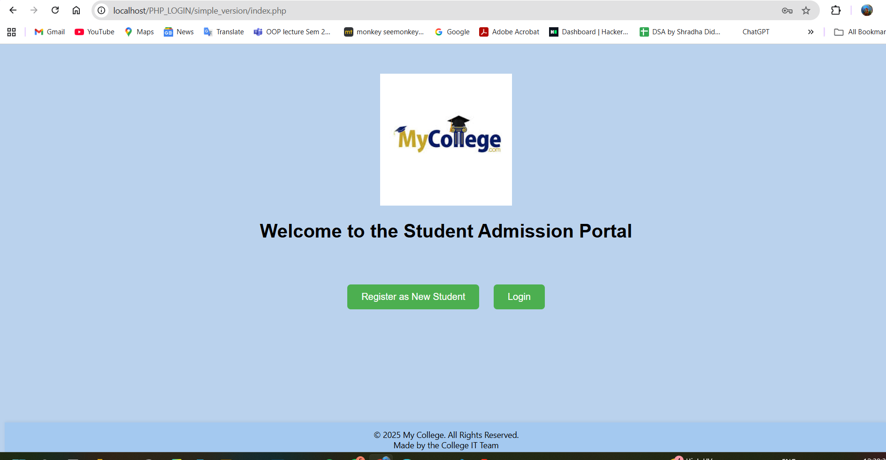
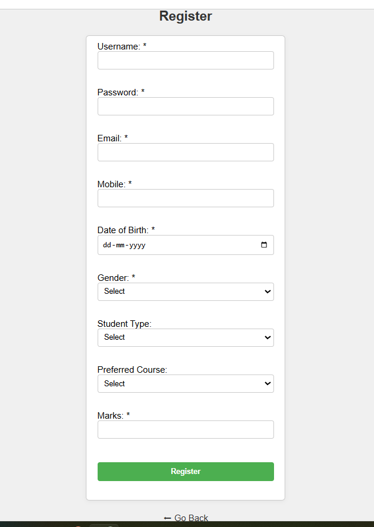
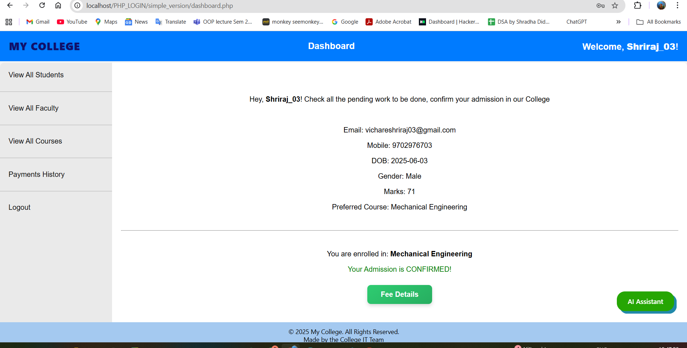
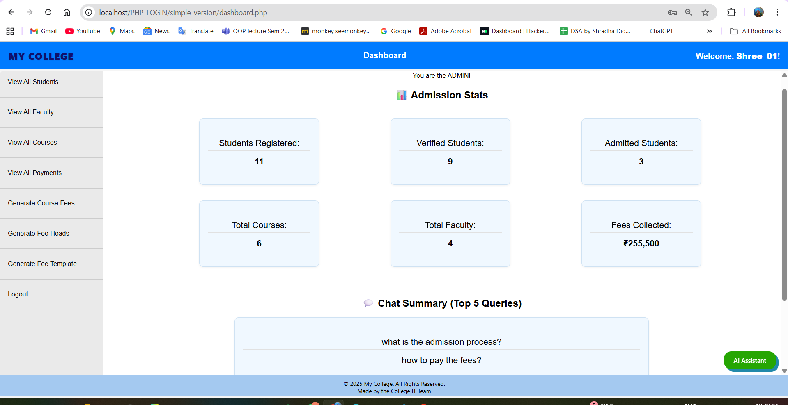
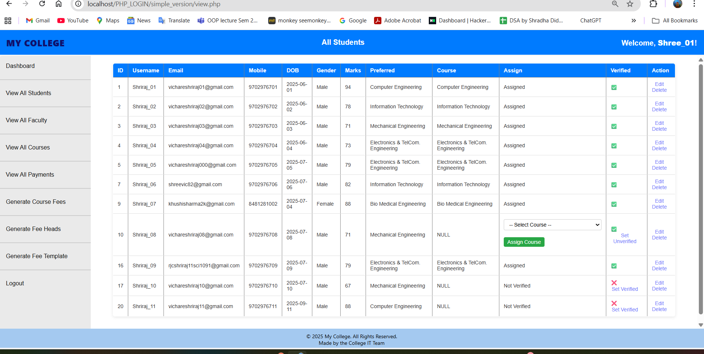
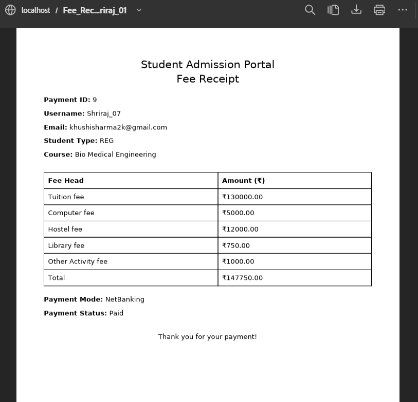
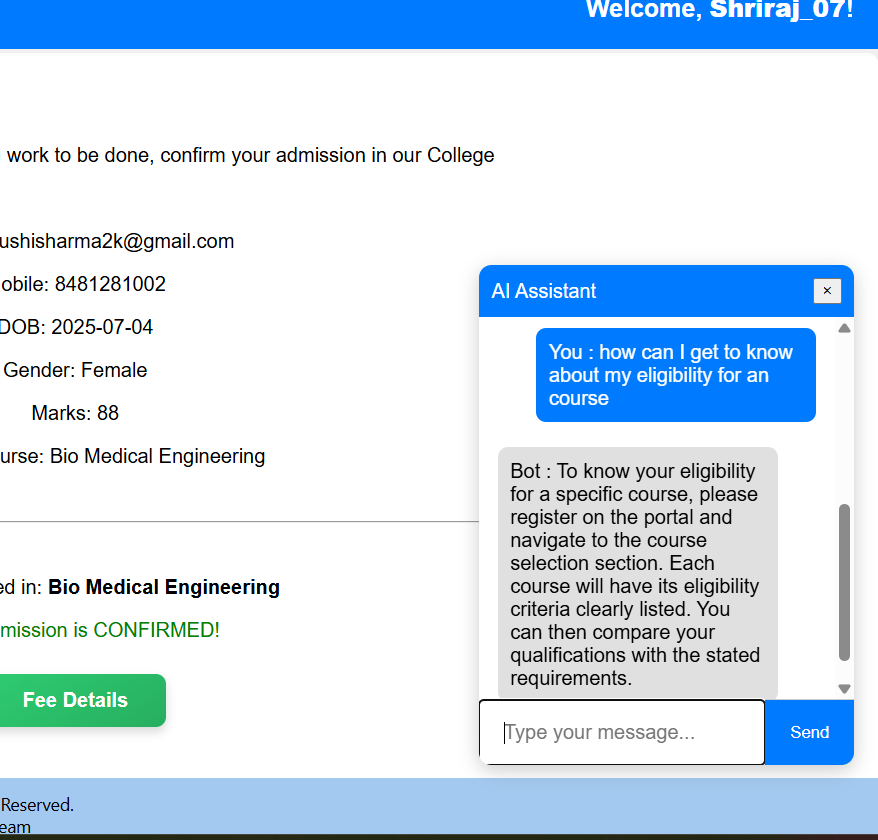

# 🎓 Smart College Admission Portal

A **web-based Student Admission Management System** built with **PHP & MySQL** to automate and streamline the admission process for students, faculty, and admins.  
The system includes **AI-powered assistance (chatbot)**, **email notifications**, course assignment, fee management, and role-based dashboards.

---

## 🚀 Features

### Student Module
- Register as a new student
- Login and access personalized dashboard
- Submit preferred courses
- Pay fees online and download receipt

### Faculty/Admin Module
- Verify student applications
- Assign courses based on preferences & marks
- Manage student and faculty records
- Generate admission reports

### Common Features
- Secure session-based login
- Role-based dashboards (Student / Faculty / Admin)
- **Automated email notifications** (course assignment, fee confirmation, etc.)
- **Integrated AI Assistant (Chatbot)** for admission-related queries
- Fee receipt generation (PDF-style)
- Clean and simple UI

---

## 🤖 AI Assistant (Chatbot)

- The chatbot first searches for answers in the **database table**.  
- If no answer is found, it queries the **Gemini AI API**.  
- New question-answer pairs are **automatically saved** in the database for future use, making the bot faster and smarter over time.  
- Handles FAQs like registration process, course details, fee structure, deadlines, etc.  

> ⚠️ **Note:** The GitHub repo uses a **placeholder API key** for security. The real key should be kept locally in `chatbot.local.php`.

---

## 🛠️ Tech Stack
- **Frontend:** HTML, CSS  
- **Backend:** PHP  
- **Database:** MySQL  
- **Server (local):** XAMPP / WAMP  
- **AI Assistant:** PHP + JavaScript (Gemini API)  
- **Email Service:** PHPMailer  

---

## 📸 Screenshots

### Landing Page


### Registration Page


### Student Dashboard


### Admin Dashboard


### Course Assignment


### Fee Receipt


### AI Assistant (Chatbot)


---

## 📂 Project Setup (Localhost)

1. Clone the repo:  
```bash
git clone https://github.com/yourusername/smart_college_admission_portal.git
